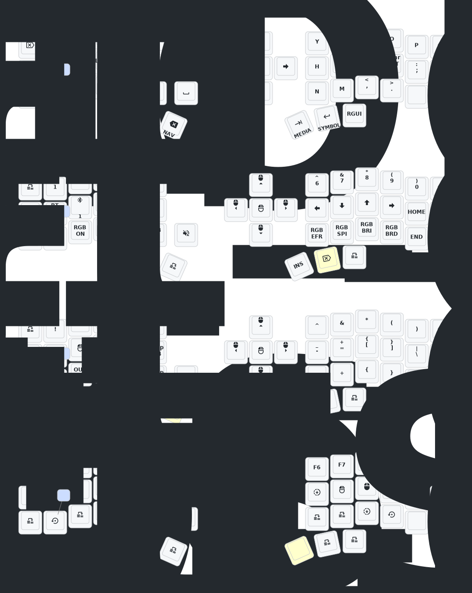

## Keymap Diagram

## Instructions

1. [Fork this repository](https://docs.github.com/en/get-started/quickstart/fork-a-repo#forking-a-repository).
2. [Click the **Actions** tab and make sure the workflow is enabled](https://docs.github.com/en/actions/managing-workflow-runs-and-deployments/managing-workflow-runs/disabling-and-enabling-a-workflow#enabling-a-workflow).

**If you already have a ZMK config repository, [you can add this one as a module instead of forking](https://zmk.dev/docs/features/modules#building-with-modules).**